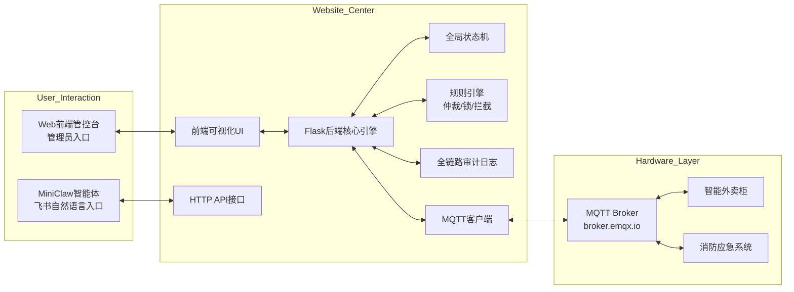

# Website 智慧中控平台
**AIoT 智慧城市中控系统 · 全系统唯一核心中枢 | Flask 后端 + 可视化前端 | 指令仲裁 · 状态同步 · 审计日志**

[](https://www.python.org/)
[](https://flask.palletsprojects.com/)
[](https://mqtt.org/)
[](LICENSE)

---

## 📋 项目简介
Website 智慧管控平台是**AIoT 智慧城市中控系统的唯一核心中枢**，采用「前端可视化UI + Flask后端核心引擎」的B/S架构，负责全系统的**指令统一收口、规则校验、优先级仲裁、全局状态管理、全链路审计日志**，从根源上解决多入口并发竞态问题，同时为管理员提供直观的可视化管控界面，为MiniClaw智能体提供标准化HTTP API接口。

### 核心定位
- ✅ **全系统唯一指令入口**：所有控制指令（Web前端/MiniClaw）必须经过本平台校验后下发
- ✅ **全局状态机**：全系统唯一状态真相来源，实时同步所有硬件终端状态
- ✅ **规则引擎**：权限校验、优先级仲裁、忙碌互斥锁、应急状态拦截
- ✅ **可视化管控**：管理员直观查看设备状态、手动下发指令、查看审计日志
- ✅ **标准化API**：为MiniClaw智能体提供RESTful HTTP接口，无缝对接

---

## 🏗️ 系统架构
### 整体架构图


---

## ✨ 核心功能
### 1. 前端可视化管控
- 实时仪表盘：展示所有硬件终端在线状态、运行状态、应急状态
- 手动控制：按钮式下发开关锁、触发/解除应急指令
- 状态历史：查看设备状态变化历史记录
- 审计日志：查看全系统所有操作记录，支持时间、来源筛选

### 2. 后端核心引擎
- **全局状态机**：维护全系统唯一状态真相，实时同步硬件上报状态
- **规则引擎**：
  - 权限校验：区分管理员/普通用户权限
  - 优先级仲裁：应急指令 > 关锁指令 > 开锁指令
  - 忙碌互斥锁：设备执行期间拒绝新指令
  - 应急状态拦截：应急期间拒绝所有普通开锁指令
- **全链路审计日志**：记录所有操作的时间、来源、指令、执行结果
- **MQTT客户端**：对接MQTT Broker，实现硬件指令下发与状态接收
- **HTTP API接口**：为MiniClaw智能体提供标准化接口

---

## 🚀 快速开始
### 1. 环境准备
- Python 3.8+
- pip 包管理器
- 2.4GHz WiFi（与硬件终端同一网络）

### 2. 安装依赖
```bash
# 克隆项目仓库
git clone <你的仓库地址>
cd website-control-center

# 安装Python依赖
pip install -r requirements.txt
```

### 3. 配置系统
打开 `config.py` 文件，修改核心配置：
```python
# Flask服务配置
FLASK_HOST = "0.0.0.0"
FLASK_PORT = 5000
FLASK_DEBUG = True

# MQTT Broker配置
MQTT_BROKER = "broker.emqx.io"
MQTT_PORT = 1883
MQTT_CLIENT_ID = "m5_control_center_web"
MQTT_KEEPALIVE = 60

# 系统规则配置
EMERGENCY_LOCK_ENABLED = True  # 应急状态锁定开关
BUSY_LOCK_ENABLED = True       # 忙碌互斥锁开关
```

### 4. 启动服务
```bash
# 启动Flask后端服务
python app.py
```

### 5. 访问管控台
打开浏览器，访问 `http://localhost:5000`（或 `http://[你的电脑IP]:5000`），即可看到可视化管控界面。

---

## 📡 API 接口文档（MiniClaw 对接专用）
### 接口1：全局状态拉取
- **接口路径**：`GET /api/status`
- **请求参数**：无
- **响应示例**：
```json
{
  "code": 200,
  "msg": "success",
  "data": {
    "A": "正常关闭",
    "B": "正常",
    "emergency": false,
    "timestamp": 1713000000
  }
}
```
- **状态码说明**：
  - `200`：成功
  - `500`：服务端错误

---

### 接口2：控制指令提交
- **接口路径**：`POST /api/send_cmd`
- **请求头**：`Content-Type: application/json`
- **请求体示例**：
```json
{
  "target": "A",
  "cmd": "UNLOCK",
  "source": "MiniClaw",
  "seq_id": "1713000000_abc123"
}
```
- **请求参数说明**：
  | 参数 | 类型 | 必填 | 说明 |
  |------|------|------|------|
  | `target` | string | 是 | 目标设备：`A`（外卖柜）/ `B`（消防）/ `all`（全局） |
  | `cmd` | string | 是 | 标准指令：`UNLOCK`/`LOCK`/`EMERGENCY_FIRE`/`EMERGENCY_STOP` |
  | `source` | string | 是 | 指令来源：`Web`/`MiniClaw` |
  | `seq_id` | string | 是 | 唯一序列号（格式：`时间戳_随机数`） |
- **响应示例**：
```json
{
  "code": 200,
  "msg": "指令已下发",
  "data": {
    "status": "pending",
    "seq_id": "1713000000_abc123"
  }
}
```
- **状态码说明**：
  - `200`：成功
  - `400`：参数错误
  - `403`：权限不足/应急状态拦截/设备忙碌
  - `500`：服务端错误

---

## 📦 MQTT 主题规范
| 主题 | 方向 | QoS | 说明 |
|------|------|-----|------|
| `city/device_A/cmd` | 平台 → 外卖柜 | 1 | 外卖柜控制指令下发 |
| `city/status/a` | 外卖柜 → 平台 | 0 | 外卖柜状态上报 |
| `city/all/cmd` | 平台 → 全设备 | 2 | 全局应急指令广播 |
| `city/status/b` | 消防 → 平台 | 1 | 消防系统状态上报 |

---

## 📁 项目结构
```
website-control-center/
├── app.py                          # Flask后端主程序
├── config.py                       # 系统配置文件
├── requirements.txt                # Python依赖
├── templates/
│   └── index.html                  # 前端可视化页面
├── static/
│   ├── css/                        # 前端样式文件
│   └── js/                         # 前端脚本文件
├── logs/                           # 审计日志存储目录
└── README.md                       # 项目说明
```

---

## ❓ 常见问题 FAQ
### 1. 前端无法访问怎么办？
- 确认Flask服务已正常启动，无报错
- 确认访问地址正确，端口未被占用
- 确认防火墙未拦截5000端口
- 局域网访问时，使用电脑的局域网IP而非`localhost`

### 2. MQTT连接失败怎么办？
- 确认所有设备（平台/硬件）接入同一2.4GHz WiFi
- 确认MQTT Broker地址、端口配置正确
- 确认MQTT Client ID全局唯一，无重复
- 确认无防火墙/网络拦截MQTT流量

### 3. 硬件指令无响应怎么办？
- 查看前端仪表盘，确认硬件在线
- 查看审计日志，确认指令已通过校验并下发
- 确认硬件已正确订阅对应指令主题
- 确认系统未处于应急状态，设备未处于忙碌状态

### 4. 如何查看审计日志？
- 前端管控台「审计日志」页面可直接查看
- 日志文件存储在`logs/`目录下，支持直接打开查看

---

## 📄 许可证
本项目基于 [MIT 许可证](sslocal://flow/file_open?url=LICENSE&flow_extra=eyJsaW5rX3R5cGUiOiJjb2RlX2ludGVycHJldGVyIn0=) 开源，可自由使用、修改、分发，仅需保留原作者版权声明。

---

## 🤝 贡献指南
欢迎提交Issue与PR优化项目：
1. Fork 本仓库
2. 创建功能分支 (`git checkout -b feature/AmazingFeature`)
3. 提交修改 (`git commit -m 'Add some AmazingFeature'`)
4. 推送到分支 (`git push origin feature/AmazingFeature`)
5. 提交 Pull Request
